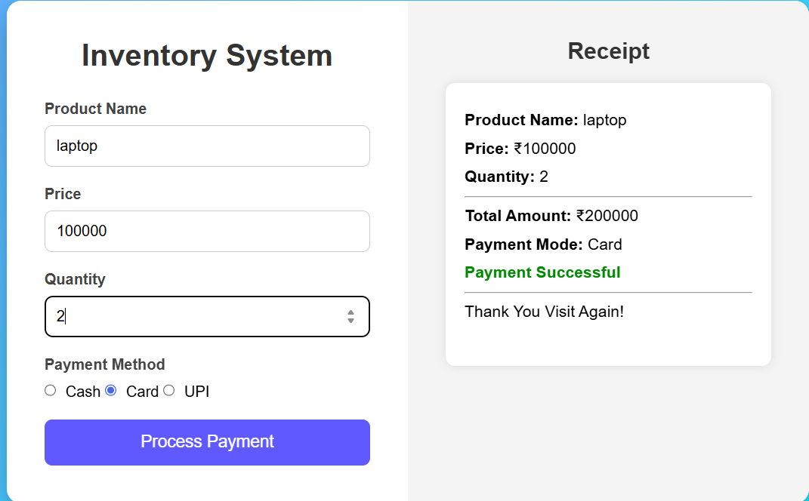

# Inventory Management System

This project is a Java-based Inventory Management System developed to manage product details and simulate different payment methods. It provides a simple graphical interface where users can enter product information, select a payment mode, and generate a receipt. The system is designed to demonstrate core programming concepts in a practical way.

------------------------------------------------------------

📌 Overview
A Java application with GUI (Swing) that demonstrates Object-Oriented Programming (OOP) concepts like interfaces and polymorphism.

The project also includes an index.html webpage to present the project in a professional web format.

------------------------------------------------------------

🚀 Features
• Product entry (Name, Price, Quantity)
• Multiple payment methods:
    - Cash
    - Card
    - UPI
• Receipt generation
• Simple and user-friendly interface
• Webpage support using HTML

------------------------------------------------------------

🛠️ Technologies Used
• Java
• Swing
• HTML
• CSS

------------------------------------------------------------

📂 Project Structure
• AppGUI.java
• Product.java
• Payment.java
• CashPayment.java
• CardPayment.java
• UPIPayment.java
• index.html
• README.md

------------------------------------------------------------

▶️ How to Run

Run Java Project
1. Compile all Java files
2. Run the main GUI application

Run Webpage
1. Open index.html in any browser
OR
2. Run using VS Code Live Server

------------------------------------------------------------

📸 Output
• Java Swing GUI for Inventory Management
• Professional project webpage using HTML

------------------------------------------------------------

## 👩‍💻 Author

Soujanya P M
